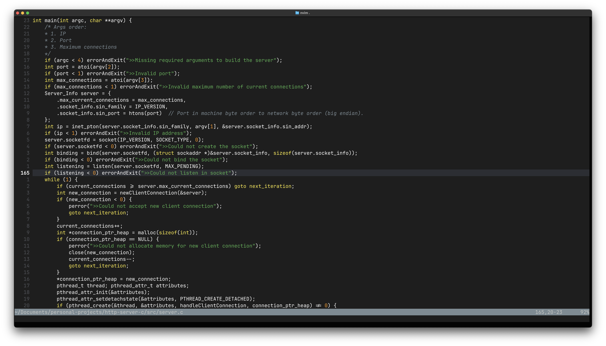
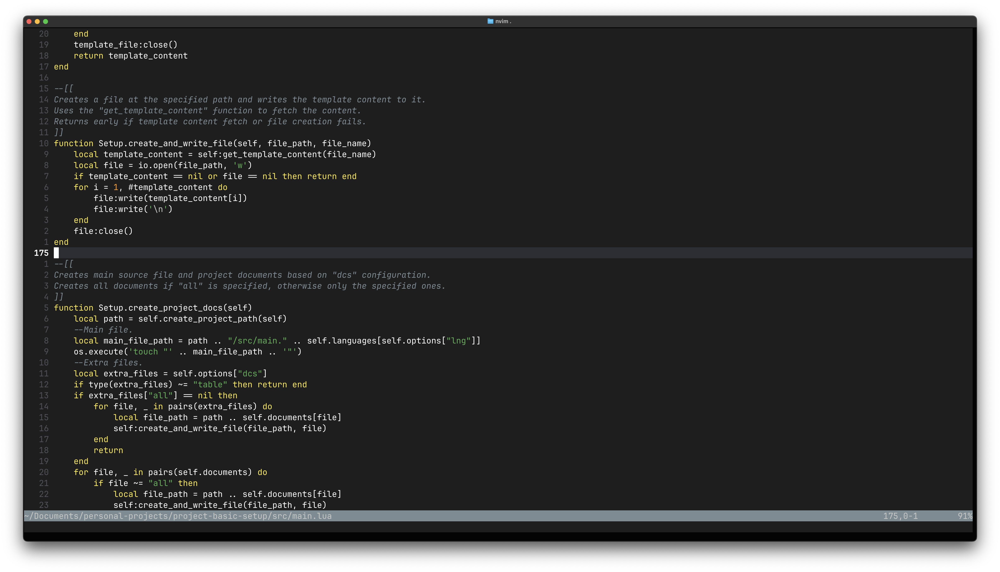

# Minimal Madness Nvim

A minimalist Neovim colorscheme inspired by Gruber Darker. Clean, distraction-free coding with subtle color distinctions where they matter.

---

## Screenshots

<div align="center">
    
    
    
</div>

---

## Installation

Using [lazy.nvim](https://github.com/folke/lazy.nvim) (recommended)
```lua
{
  "leojimenezg/minimal-madness-nvim",
  lazy = false,
  priority = 1000,
  config = function()
    vim.cmd.colorscheme("minimal-madness-nvim")
  end,
}
```

Using [packer.nvim](https://github.com/wbthomason/packer.nvim)
```lua
use {
  "leojimenezg/minimal-madness-nvim",
  config = function()
    vim.cmd.colorscheme("minimal-madness-nvim")
  end
}
```

Using [vim-plug](https://github.com/junegunn/vim-plug)
```lua
Plug 'leojimenezg/minimal-madness-nvim'
colorscheme minimal-madness-nvim
```

### Configuration (Optional)
You can customize the colorscheme by calling the `setup()` function before applying the colorscheme:
```lua
{
  "leojimenezg/minimal-madness-nvim",
  lazy = false,
  priority = 1000,
  config = function()
    require("minimal-madness-nvim").setup({
      styles = {
        comments = { italic = true },
        keywords = { italic = false },
        functions = { italic = false, bold = false },
        variables = { italic = false },
        headings = { bold = false },
      },
      transparent_background = false,
      overrides = {},
    })
    vim.cmd.colorscheme("minimal-madness-nvim")
  end,
}
```

## Requirements

* Neovim >= 0.8.0
* [nvim-treesitter](https://github.com/nvim-treesitter/nvim-treesitter) (highly recommended)

---

## Notes

* This colorscheme is inspired by the Gruber Darker theme in Emacs. Sometimes less is more - this theme embraces simplicity while maintaining clear visual hierarchy for effective coding, focusing on meaningful distinctions that enhance readability without overwhelming your eyes with a rainbow of colors.
* It is highly recommended to have nvim-treesitter installed, as this project takes great advantage of its highlighting groups and capabilities. While the colorscheme works without Treesitter, you'll get the best experience with it installed.* This is a project is still been developed and has a lot of work to be made. However, keep in mind this colorscheme is entirely based on my personal preferences and I will make changes based on my needs.
* This colorscheme has been specifically tested and optimized for the main languages I use (C, Go, Python, Lua), it works perfectly for these languages, but I cannot ensure its behavior in other programming languages I have not used.
* This project is still being developed and has a lot of work to be made. However, keep in mind this colorscheme is entirely based on my personal preferences and I will make changes based on my needs. That said, community feedback and contributions are valued.
* Feel free to make any changes or contribute to this project. Contributions are welcome - please report bugs, suggest improvements, or add support for additional languages.
